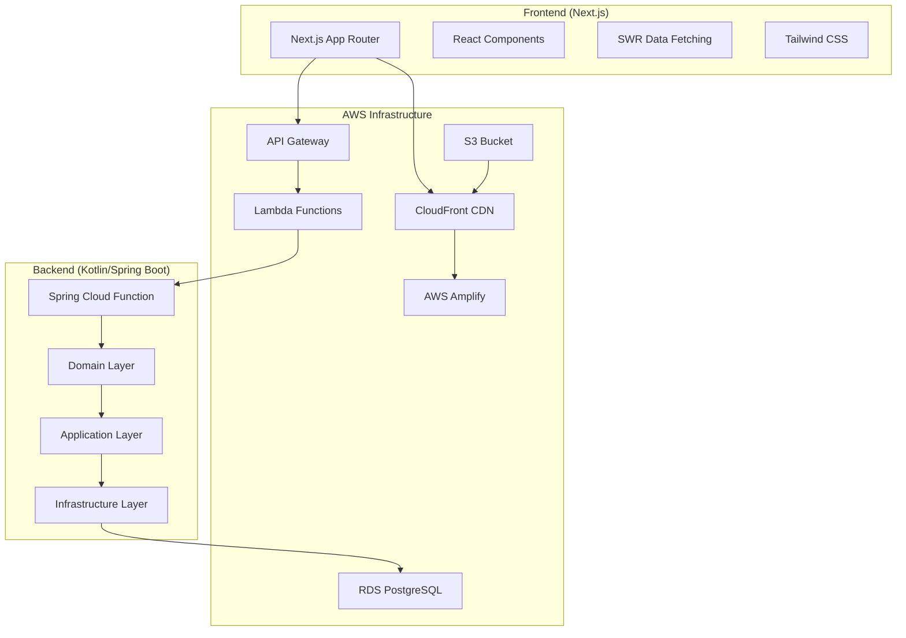
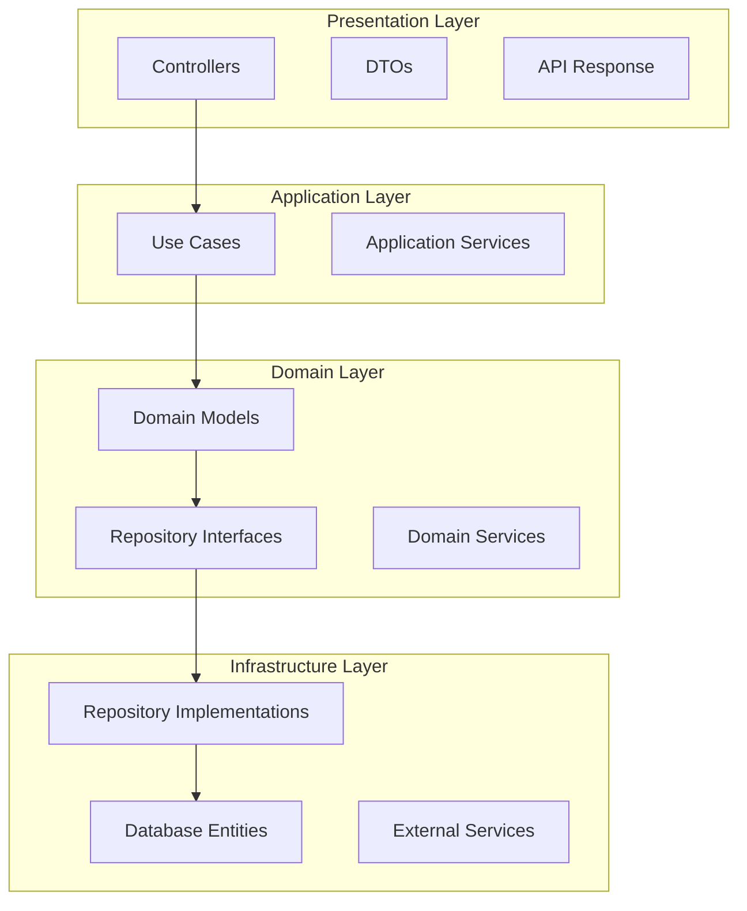

# 設計書

## 概要

だんいんポータルは、Next.js（フロントエンド）とKotlin/Spring Boot（バックエンド）を使用したフルスタックWebアプリケーションです。AWS上でサーバーレスアーキテクチャを採用し、高可用性とスケーラビリティを実現しています。

## アーキテクチャ

### システム全体構成



### レイヤー構成（バックエンド）



## コンポーネントとインターフェース

### フロントエンドコンポーネント構成

#### 1. ページレベルコンポーネント
- **ホーム画面** (`/`): プロフィール、統計、プレビューセクション
- **ニュース** (`/news`): 記事一覧、検索、フィルタリング
- **アーカイブ** (`/archives`): 動画・配信一覧、高度な検索機能
- **楽曲** (`/songs`): 楽曲データベース、検索・ソート機能
- **カレンダー** (`/calendar`): イベントカレンダー表示

#### 2. 共通コンポーネント
- **Header/Navigation**: サイト全体のナビゲーション
- **Footer**: サイト情報とリンク
- **PageLayout**: 共通レイアウトコンポーネント
- **SearchInput**: 統一された検索インターフェース
- **Pagination**: ページネーション機能
- **ResponsiveSidebar**: レスポンシブサイドバー

#### 3. 機能別コンポーネント
- **VideoCard**: 動画・配信情報表示
- **NewsCard**: ニュース記事カード
- **SongCard**: 楽曲情報表示
- **FilterSection**: 検索・フィルタリング機能
- **DateRangeSelector**: 日付範囲選択

### バックエンドAPI設計

#### 1. RESTful API エンドポイント

```
GET  /health                    # ヘルスチェック
POST /videos                    # 動画一覧取得（検索・フィルタ対応）
POST /streams                   # 配信一覧取得（検索・フィルタ対応）
POST /news                      # ニュース一覧取得（検索・フィルタ対応）
GET  /news/categories           # ニュースカテゴリ一覧
POST /songs                     # 楽曲一覧取得（検索・ソート対応）
POST /calendar/events           # カレンダーイベント取得
```

#### 2. リクエスト/レスポンス形式

**共通ページネーション形式:**
```json
{
  "content": [...],
  "pagination": {
    "page": 1,
    "size": 20,
    "totalElements": 150,
    "totalPages": 8,
    "hasNext": true,
    "hasPrevious": false
  }
}
```

**検索・フィルタリクエスト形式:**
```json
{
  "query": "検索キーワード",
  "filters": {
    "tags": ["tag1", "tag2"],
    "dateRange": {
      "start": "2024-01-01",
      "end": "2024-12-31"
    },
    "category": "カテゴリー名"
  },
  "sort": {
    "field": "publishedAt",
    "direction": "DESC"
  },
  "pagination": {
    "page": 1,
    "size": 20
  }
}
```

## データモデル

### 1. 動画・配信関連

```kotlin
// Video Domain Model
data class Video(
    val id: Long,
    val title: String,
    val description: String,
    val youtubeId: String,
    val thumbnailUrl: String,
    val publishedAt: LocalDateTime,
    val duration: Duration?,
    val viewCount: Long?,
    val channel: Channel,
    val tags: List<VideoTag>,
    val types: List<VideoType>,
    val streamDetails: StreamDetails?
)

// Channel Domain Model
data class Channel(
    val id: Long,
    val name: String,
    val youtubeChannelId: String,
    val description: String?
)

// VideoTag Domain Model
data class VideoTag(
    val id: Long,
    val name: String,
    val color: String?
)
```

### 2. ニュース関連

```kotlin
// News Domain Model
data class News(
    val id: Long,
    val title: String,
    val content: String,
    val summary: String?,
    val publishedAt: LocalDateTime,
    val category: NewsCategory,
    val thumbnailUrl: String?,
    val isPublished: Boolean
)

// NewsCategory Domain Model
data class NewsCategory(
    val id: Long,
    val name: String,
    val description: String?,
    val color: String?
)
```

### 3. 楽曲関連

```kotlin
// Song Domain Model
data class Song(
    val id: Long,
    val title: String,
    val artist: String,
    val originalArtist: String?,
    val singCount: Int,
    val firstSungAt: LocalDateTime,
    val lastSungAt: LocalDateTime,
    val videos: List<Video>
)
```

### 4. カレンダー関連

```kotlin
// Event Domain Model
data class Event(
    val id: Long,
    val title: String,
    val description: String?,
    val startDateTime: LocalDateTime,
    val endDateTime: LocalDateTime?,
    val eventType: EventType,
    val url: String?,
    val isAllDay: Boolean
)
```

## データベース設計

### 主要テーブル構成

```sql
-- 動画・配信テーブル
CREATE TABLE videos (
    id BIGSERIAL PRIMARY KEY,
    title VARCHAR(500) NOT NULL,
    description TEXT,
    youtube_id VARCHAR(50) UNIQUE NOT NULL,
    thumbnail_url VARCHAR(500),
    published_at TIMESTAMP NOT NULL,
    duration INTERVAL,
    view_count BIGINT,
    channel_id BIGINT REFERENCES channels(id),
    created_at TIMESTAMP DEFAULT CURRENT_TIMESTAMP
);

-- 全文検索インデックス
CREATE INDEX idx_videos_description_gin ON videos USING gin(to_tsvector('japanese', description));
CREATE INDEX idx_videos_published_at_desc ON videos (published_at DESC);

-- ニューステーブル
CREATE TABLE news (
    id BIGSERIAL PRIMARY KEY,
    title VARCHAR(500) NOT NULL,
    content TEXT NOT NULL,
    summary TEXT,
    published_at TIMESTAMP NOT NULL,
    category_id BIGINT REFERENCES news_categories(id),
    thumbnail_url VARCHAR(500),
    is_published BOOLEAN DEFAULT false,
    created_at TIMESTAMP DEFAULT CURRENT_TIMESTAMP
);

-- 楽曲テーブル
CREATE TABLE songs (
    id BIGSERIAL PRIMARY KEY,
    title VARCHAR(500) NOT NULL,
    artist VARCHAR(200) NOT NULL,
    original_artist VARCHAR(200),
    sing_count INTEGER DEFAULT 0,
    first_sung_at TIMESTAMP,
    last_sung_at TIMESTAMP,
    created_at TIMESTAMP DEFAULT CURRENT_TIMESTAMP
);
```

### インデックス戦略

1. **検索最適化**
   - 全文検索用GINインデックス（日本語対応）
   - 複合インデックスによる効率的なフィルタリング

2. **ソート最適化**
   - 日付フィールドの降順インデックス
   - 歌唱回数、再生回数等の数値フィールドインデックス

3. **外部キー最適化**
   - 頻繁に結合されるテーブル間の外部キーインデックス

## エラーハンドリング

### 1. フロントエンドエラーハンドリング

```typescript
// エラー境界コンポーネント
class ErrorBoundary extends React.Component {
  // エラー状態管理とフォールバックUI表示
}

// API エラーハンドリング
const handleApiError = (error: AxiosError) => {
  switch (error.response?.status) {
    case 400: // バリデーションエラー
    case 404: // リソース未発見
    case 500: // サーバーエラー
    default: // その他のエラー
  }
}
```

### 2. バックエンドエラーハンドリング

```kotlin
// ドメインエラー定義
sealed class DomainError(
    val code: ErrorCode,
    val message: String,
    val cause: Throwable? = null
) : Exception(message, cause)

// エラーレスポンス形式
data class ErrorResponse(
    val code: String,
    val message: String,
    val details: Map<String, Any>? = null,
    val timestamp: Instant = Instant.now()
)

// グローバルエラーハンドラー
@ControllerAdvice
class GlobalExceptionHandler {
    @ExceptionHandler(DomainError::class)
    fun handleDomainError(error: DomainError): ResponseEntity<ErrorResponse>
}
```


## パフォーマンス最適化

### 1. フロントエンド最適化

- **コード分割**: Next.js動的インポートによる遅延読み込み
- **画像最適化**: Next.js Image コンポーネントによる自動最適化
- **キャッシュ戦略**: SWRによるクライアントサイドキャッシュ
- **バンドル最適化**: Tree shakingとコード圧縮

### 2. バックエンド最適化

- **データベース最適化**: 適切なインデックス設計
- **クエリ最適化**: N+1問題の回避
- **キャッシュ戦略**: Redis等の外部キャッシュ（将来実装）
- **接続プール**: R2DBC接続プール設定

### 3. インフラ最適化

- **CDN活用**: CloudFrontによる静的コンテンツ配信
- **Lambda最適化**: コールドスタート時間の最小化
- **データベース**: RDS最適化設定

## セキュリティ

### セキュリティ対策

- **CORS設定**: 適切なオリジン制限
- **入力検証**: バリデーション機能の実装
- **SQLインジェクション対策**: パラメータ化クエリの使用
- **XSS対策**: 適切なエスケープ処理

## デプロイメント

### 現在の実装状況

#### フロントエンド
- **プラットフォーム**: AWS Amplify
- **デプロイ方法**: GitHub Actions経由での自動デプロイ
- **環境**: 開発環境（dev）、本番環境（prd）
- **CDN**: CloudFront経由での配信

#### バックエンド
- **プラットフォーム**: AWS Lambda + API Gateway
- **デプロイ方法**: GitHub Actions経由でのJARファイルデプロイ
- **データベース**: RDS PostgreSQL
- **環境管理**: Terraform（Infrastructure as Code）

#### 画像配信
- **ストレージ**: S3 Bucket
- **CDN**: CloudFront
- **アップロード**: AWS Console経由での手動アップロード

### デプロイコマンド

```bash
# フロントエンドデプロイ
gh workflow run deploy-frontend.yml --field environment=dev
gh workflow run deploy-frontend.yml --field environment=prd

# バックエンドデプロイ
gh workflow run temp-deploy-backend.yml --field environment=dev
gh workflow run temp-deploy-backend.yml --field environment=prd

# インフラ構築
gh workflow run terraform.yml --field environment=dev --field action=plan
gh workflow run terraform.yml --field environment=dev --field action=apply

gh workflow run terraform.yml --field environment=prd --field action=plan
gh workflow run terraform.yml --field environment=prd --field action=apply
```